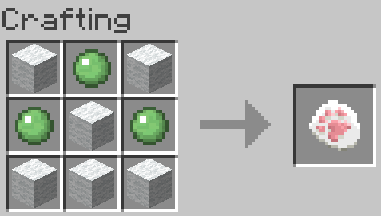
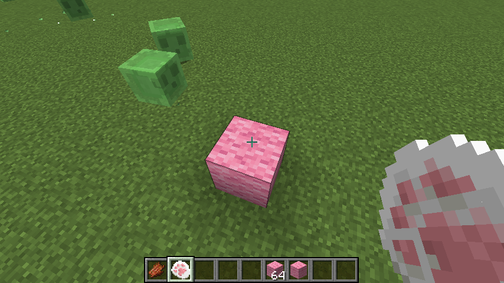
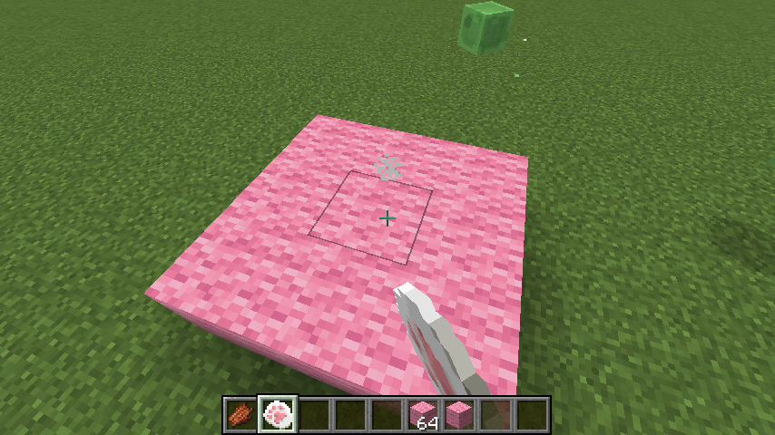

#  Nekonote Reloaded

Puts block on 3x3 area

ブロックを3x3の範囲に設置するMod

## Download

You can download here: [CurseForge](https://www.curseforge.com/minecraft/mc-mods/block-area-putting-wand)

## Requires

* Currently supports only Minecraft 1.12.2
* [Minecraft Forge 1.12.2 - 14.23.5.2847](http://files.minecraftforge.net/maven/net/minecraftforge/forge/index_1.12.2.html) or later
* [Shadowfacts' Forgelin](https://www.curseforge.com/minecraft/mc-mods/shadowfacts-forgelin/files/2785465) 1.8.4 or later

## Recipe

Craft by 6 any wools and 3 slimeballs.

## Usage

1. Get lots of blocks you want to place
1. Put one of the block
1. Right click to the block by Helper Cat Paw.

## License

MIT
